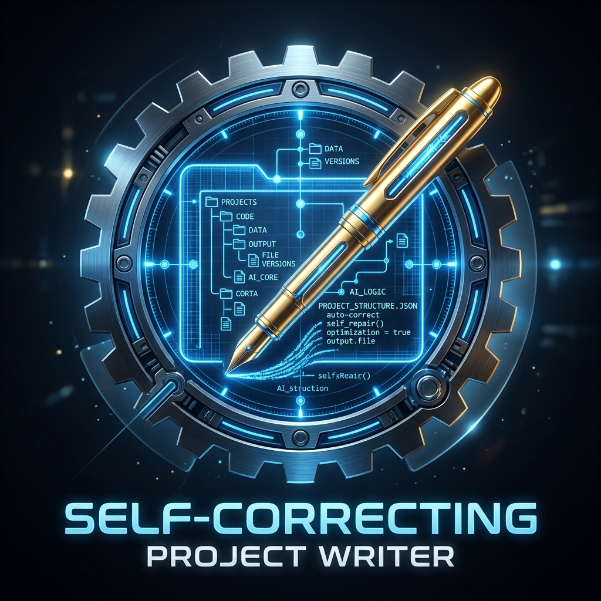
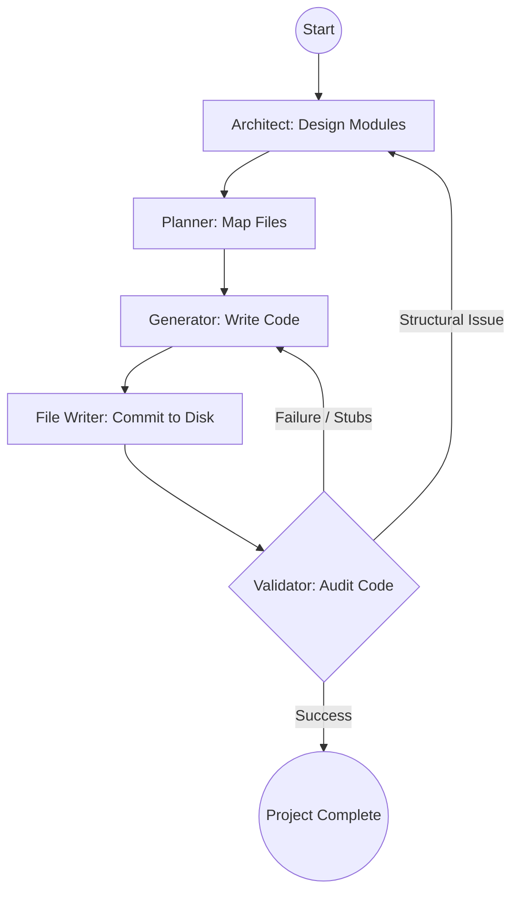

# 🛠️ Self-Correcting Project Writer



> **Autonomous. Hierarchical. Self-Healing.**

**Self-Correcting Project Writer** is a next-generation autonomous agentic system designed to build complete, production-ready Python projects from a single natural language prompt. Unlike traditional code generators, it employs a **multi-pass architect-planner-fixer loop** to ensure structural integrity and functional correctness.

---

## 🚀 Key Features

*   **🏛️ Hierarchical Planning**: Uses a "Senior Architect" to define the system structure and a "Lead Developer" to plan individual modules.
*   **⚡ Multi-Pass Generation**:
    *   **Pass 1 (Parallel Draft)**: Rapidly scaffolds all files in parallel for maximum speed.
    *   **Pass 2+ (Sequential Polish)**: Re-evaluates and refines code sequentially, allowing the agent to "read" previously written files to maintain cross-module consistency.
*   **🔄 Self-Correction Loop**: An integrated **Validator Node** audits generated code for stubs, placeholders, or logic errors, triggering automatic re-generation of faulty components.
*   **🦙 Local-First Intelligence**: Optimized for local execution using **Ollama** and high-performance models like `qwen2.5-coder`.
*   **📂 Automatic Workspace Management**: Dynamically creates unique, organized project directories for every run.

---

## 🏗️ System Architecture

The application is built on **LangGraph**, utilizing a state-based workflow to manage the lifecycle of a project:



---

## 🛠️ Installation

### Prerequisites
- **Python 3.10+**
- **Ollama** (running locally)

### Setup
1. **Clone the repository**:
   ```bash
   git clone <repo-url>
   cd self-correcting-project-writer
   ```

2. **Create and activate a virtual environment**:
   ```bash
   python -m venv venv
   source venv/bin/activate  # On Windows: venv\Scripts\activate
   ```

3. **Install dependencies**:
   ```bash
   pip install -r requirements.txt
   ```

4. **Configure environment variables**:
   Create a `.env` file in the root directory:
   ```env
   OLLAMA_HOST=http://127.0.0.1:11434
   PLANNER_MODEL=qwen2.5-coder:7b
   GENERATOR_MODEL=qwen2.5-coder:7b
   ```

---

## 📖 Usage

Run the project writer with a descriptive prompt:

```bash
python main.py "Create a CLI-based inventory management system with SQLite storage and unit tests."
```

### What happens next?
1.  **Architecting**: The agent defines folders like `src/database`, `src/api`, and `tests`.
2.  **Planning**: It lists every file needed (e.g., `db_handler.py`, `models.py`).
3.  **Generation**: Files are written. If a file is too short or contains placeholders, the **Validator** catches it and asks the **Generator** to fix it.
4.  **Finalization**: Your complete project is available in the `output/` directory.

---

## 🧪 Testing

The system is designed to be compatible with `pytest`. You can specify custom test commands in `main.py` to ensure the generated code meets your quality standards.

---

## 📜 License

This project is licensed under the MIT License.

---

<p align="center">
  Built with ❤️ by the Antigravity Team
</p>
